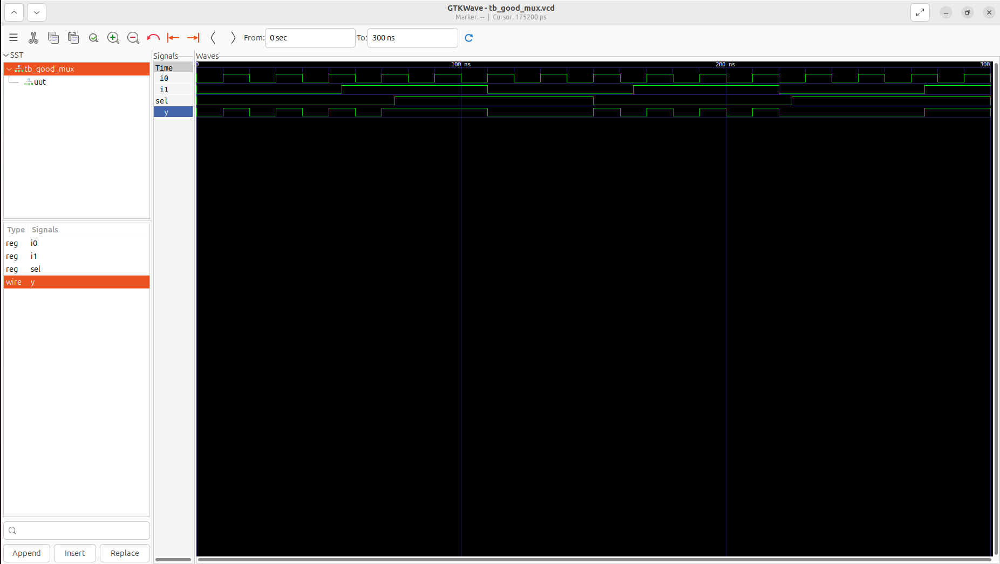
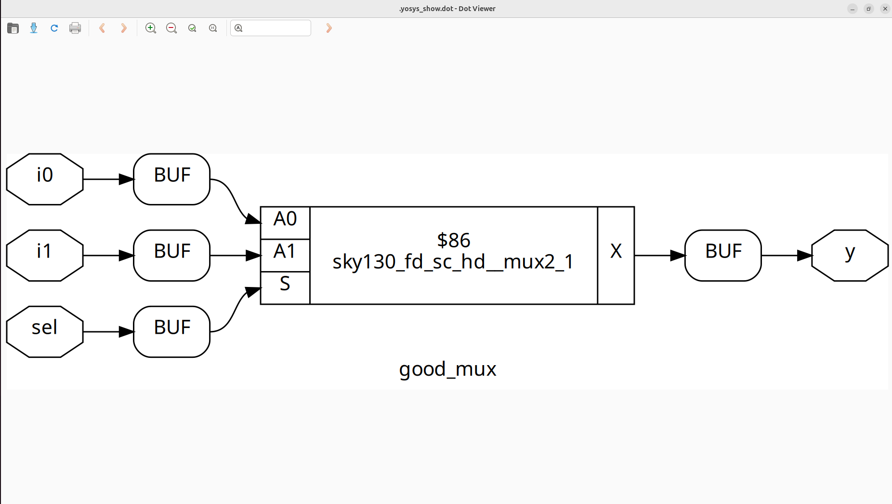

#  Day 1: Introduction to Verilog RTL Design & Synthesis

Welcome to **Day 1** of week1!
The first day was all about getting started with digital design. I learned the fundamentals of Verilog, explored how to run simulations using Icarus Verilog (iverilog), and got introduced to logic synthesis with Yosys. The hands-on labs and explanations made it easier for me to understand the overall RTL design flow step by step.

---

##  Table of Contents

1. [Understanding Simulator, Design, and Testbench](#1-understanding-simulator-design-and-testbench)  
2. [iverilog for Simulation](#2-iverilog-for-simulation)  
3. [Lab: Simulating a 2-to-1 Multiplexer](#3-lab-simulating-a-2-to-1-multiplexer)  
4. [Breaking Down the Verilog Code](#4-breaking-down-the-verilog-code)  
5. [Getting Familiar with Yosys & Standard Cell Libraries](#5-getting-familiar-with-yosys--standard-cell-libraries)  
6. [Running Synthesis in Yosys](#6-running-synthesis-in-yosys)  
7. [Key Learnings](#7-key-learnings)


---

## 1. Understanding Simulator, Design, and Testbench

### Simulator

A **simulator** is a tool used to validate the behavior of your digital circuit. It allows you to feed input signals into the design and observe the outputs, helping you confirm the circuit works correctly before moving to real hardware.

### Design

The **design** refers to the Verilog code you write to describe the logic and functionality of the digital system you want to build.

### Testbench

A **testbench** serves as the testing framework for your design. It provides different sets of input values to your circuit and checks whether the generated outputs match the expected results.

---

## 2. iverilog for Simulation

**Icarus Verilog** (iverilog) is an open-source compiler and simulator for the Verilog hardware description language (HDL).


-Input: Both the design and its testbench are supplied to Icarus Verilog.

-Output: The simulator generates a .vcd file, which can be viewed as waveforms using GTKWave.

---

## 3. Lab: Simulating a 2-to-1 Multiplexer

Let’s simulate a simple 2-to-1 multiplexer using Icarus Verilog (iverilog)!

###  Step 1: Clone the Workshop Repository

```shell
git clone https://github.com/kunalg123/sky130RTLDesignAndSynthesisWorkshop.git
cd sky130RTLDesignAndSynthesisWorkshop/verilog_files
```

###  Step 2: Install Required Tools

```shell
sudo apt install iverilog
sudo apt install gtkwave
```

###  Step 3: Simulate the Design

Compile the design and testbench:

```shell
iverilog good_mux.v tb_good_mux.v
```

Run the simulation:

```shell
./a.out
```

View the waveform:

```shell
gtkwave tb_good_mux.vcd
```




---

## 4. Breaking Down the Verilog Code

### 2-to-1 Multiplexer Simulation using Icarus Verilog


## Multiplexer Code (`good_mux.v`)

```verilog
module good_mux (input i0, input i1, input sel, output reg y);
always @ (*)
begin
    if(sel)
        y <= i1;
    else 
        y <= i0;
end
endmodule
```

---

### **Working**

* **Inputs:** `i0` and `i1` (data signals), `sel` (select signal)
* **Output:** `y` (registered output)
* **Behavior:** When `sel` is 1, `y` takes the value of `i1`; when `sel` is 0, `y` takes the value of `i0`.

---

## 5. Getting Familiar with Yosys & Standard Cell Libraries

###  What is Yosys?

# Yosys and Gate Libraries

# Understanding Yosys and Standard Cell Libraries

This guide explains **Yosys**, a popular open-source synthesis tool, and why digital libraries include multiple versions of logic gates.

---

## Overview of Yosys

**Yosys** is a versatile open-source tool used for digital synthesis. It takes Verilog designs and converts them into **gate-level netlists**, which act as detailed hardware blueprints ready for implementation on silicon.

### Main Capabilities of Yosys

- **Logic Synthesis:** Transforms HDL code into combinational and sequential logic  
- **Design Optimization:** Improves performance, reduces chip area, or lowers power consumption  
- **Technology Mapping:** Matches logic to actual hardware cells in a target library  
- **Design Verification:** Ensures correctness of the synthesized circuit  
- **Customizability:** Supports user-defined flows and scripts  

---

## Understanding Gate Variants in Libraries

Standard cell libraries often contain multiple versions of each gate (AND, OR, NOT, etc.) with varying characteristics. These variations allow synthesis tools to make optimal design decisions.

- **Speed:** High-performance gates for critical timing paths; slower ones for power savings  
- **Power Efficiency:** Low-power gates to reduce energy consumption  
- **Area:** Compact gates to save silicon space  
- **Drive Strength:** Stronger gates to drive larger loads or longer interconnects  
- **Signal Quality:** Specialized gates to reduce noise and improve reliability  
- **Flexible Mapping:** Allows synthesis tools to pick the best gate for specific parts of the design  

By offering these options, libraries help synthesis tools strike the best balance between **speed, power, area, and overall design reliability**.

---

## 6. Running Synthesis in Yosys

In this lab, we will synthesize the `good_mux` design using **Yosys** and generate a gate-level netlist.

### Step-by-Step Yosys Procedure

1. **Launch Yosys**
    ```shell
    yosys
    ```

2. **Load the Standard Cell Library**
    ```shell
    read_liberty -lib /address/to/your/sky130/file/sky130_fd_sc_hd__tt_025C_1v80.lib
    ```

3. **Import the Verilog Design**
    ```shell
    read_verilog /home/vsduser/VLSI/sky130RTLDesignAndSynthesisWorkshop/verilog_files/good_mux.v
    ```

4. **Run Synthesis**
    ```shell
    synth -top good_mux
    ```

5. **Perform Technology Mapping**
    ```shell
    abc -liberty /address/to/your/sky130/file/sky130_fd_sc_hd__tt_025C_1v80.lib
    ```

6. **Visualize the Gate-Level Netlist**
    ```shell
    show
    ```

### Notes

- Replace `/address/to/your/sky130/file/` with the actual path to your standard cell library.  
- The `show` command opens a graphical view of the synthesized design, allowing you to inspect the mapped gates and connections.  



## 7. Key Learnings

- I learned about simulators, digital designs, and testbenches.
- I ran my first Verilog simulation using Icarus Verilog (iverilog) and visualized the waveforms.
- I analyzed the functionality of the 2-to-1 multiplexer code.
- I explored Yosys and understood why standard cell libraries provide multiple gate variants.

---
