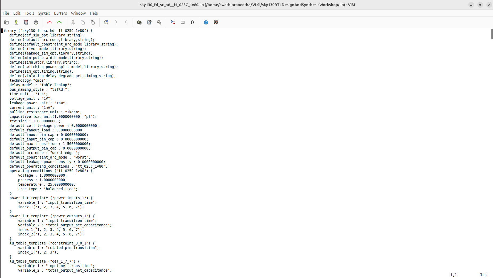
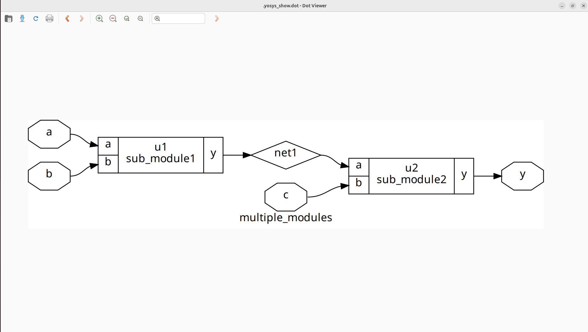
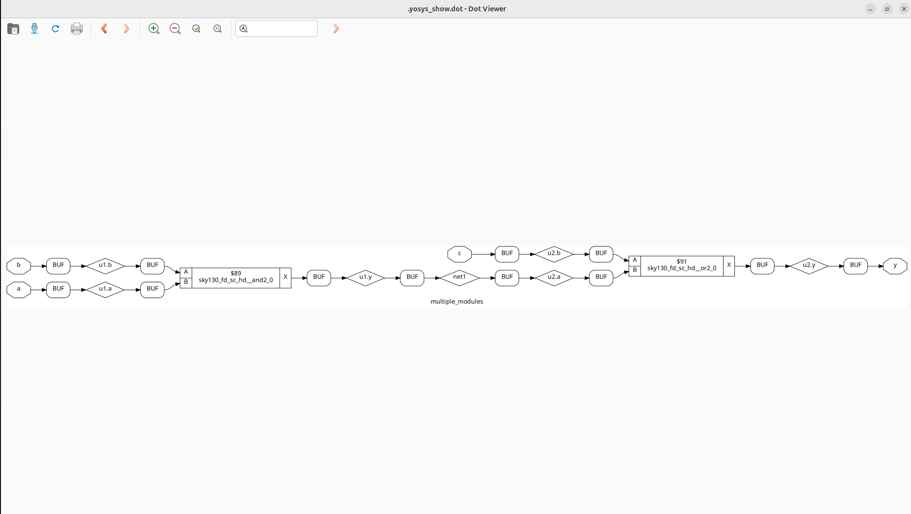

# Day 2: Timing Libraries, Synthesis Strategies, and Optimized Flip-Flop Coding

Welcome to Day 2 of the RTL Workshop!
 **Topics of the day**
- Understanding the `.lib` timing library (`sky130_fd_sc_hd__tt_025C_1v80.lib`) commonly used in open-source PDKs.  
- Comparing **hierarchical** versus **flat synthesis** approaches.  
- Exploring efficient RTL coding techniques for flip-flops.  

---
# Contents

- [Timing Libraries](#timing-libraries)  
  - [Introduction to the SKY130 PDK](#introduction-to-the-sky130-pdk)  
  - [Understanding the `tt_025C_1v80` Timing Corner](#understanding-the-tt_025c_1v80-timing-corner)  
  - [Examining the `.lib` File](#examining-the-lib-file)  

- [Hierarchical vs. Flat Synthesis](#hierarchical-vs-flat-synthesis)  
  - [What is Hierarchical Synthesis?](#what-is-hierarchical-synthesis)  
  - [What is Flat Synthesis?](#what-is-flat-synthesis)  
 
- [Flip-Flop Design Techniques](#flip-flop-design-techniques)  
  - [D Flip-Flop with Asynchronous Reset](#d-flip-flop-with-asynchronous-reset)  
  - [D Flip-Flop with Asynchronous Set](#d-flip-flop-with-asynchronous-set)  
  - [D Flip-Flop with Synchronous Reset](#d-flip-flop-with-synchronous-reset)  

- [Simulation and Synthesis Workflow](#simulation-and-synthesis-workflow)  
  - [Running Simulations with Icarus Verilog](#running-simulations-with-icarus-verilog)  
  - [Performing Synthesis with Yosys](#performing-synthesis-with-yosys)
## Timing Libraries

### Introduction to the SKY130 PDK

The SKY130 PDK is an open-source **Process Design Kit** built on SkyWater Technology's 130nm CMOS process. It includes all the necessary models and libraries for IC design, covering aspects such as timing, power, and process variations.

### Understanding the `tt_025C_1v80` Timing Corner

- **tt**: Typical process corner  
- **025C**: Operating temperature of 25°C, which affects performance  
- **1v80**: Core voltage of 1.8V  

This naming scheme helps identify the specific process, voltage, and temperature conditions that the library represents.

---

### Examining the `.lib` File

To open the `sky130_fd_sc_hd__tt_025C_1v80.lib` file:

1. **Install a text editor:**
   ```shell
   sudo apt install gedit

2. **Open the file:**
   ```shell
   gedit sky130_fd_sc_hd__tt_025C_1v80.lib
   ```
   

   ---
## Hierarchical vs. Flat Synthesis
### What is Hierarchical Synthesis?
- **Definition:** Hierarchical synthesis preserves the module structure defined in the RTL. Each module is synthesized individually rather than flattening the entire design into a single level of logic.  
- **How it Works:** Tools like Yosys analyze and process each module independently, maintaining the design hierarchy. Commands such as `hierarchy` are used to examine and set up the module relationships for synthesis.  

**Advantages:**
- Faster synthesis for large and complex designs because modules can be processed in parallel.  
- Easier debugging and analysis since module boundaries are maintained, allowing designers to isolate issues within specific modules.  
- Promotes modular design practices, making it simpler to reuse modules in other projects or integrate with additional design flows.  
- Facilitates incremental synthesis, where only modified modules need to be re-synthesized, saving time during iterative development.  

**Disadvantages:**
- Limited cross-module optimization, meaning some global performance improvements may be missed.  
- Reports and metrics might require extra configuration to combine data across modules.  
- Can result in slightly larger area or less optimal timing compared to a fully flattened design, as some synthesis opportunities across modules are not utilized.


---
### What is Flat Synthesis?
- **Definition:** Combines all modules into a single flat netlist, removing the original hierarchy.  
- **How it Works:** Tools like Yosys use the `flatten` command to collapse the module structure, enabling synthesis optimizations across the entire design.  

**Advantages:**
- Allows aggressive, cross-module optimizations that are not possible in hierarchical synthesis.  
- Can improve overall performance and reduce critical path delays.  
- Produces a unified netlist, which can simplify certain downstream processes like layout or timing analysis.  
- Useful for final implementation stages where global optimization is prioritized over modularity.  

**Disadvantages:**
- Increased runtime for large or complex designs due to processing the entire flattened netlist at once.  
- Loss of module hierarchy makes debugging and analysis more difficult.  
- Can lead to higher memory usage and more complex netlists.  
- Reduces modularity, making incremental synthesis and design reuse harder.
  


---
# Flip-Flop Design Techniques
Flip-flops are essential sequential elements in digital circuits, used to store and transfer binary data. Below are efficient RTL coding examples for flip-flops with different reset and set behaviors.

### D Flip-Flop with Asynchronous Reset
```verilog
module dff_asyncres (input clk, input async_reset, input d, output reg q);
  always @ (posedge clk, posedge async_reset)
    if (async_reset)
      q <= 1'b0;
    else
      q <= d;
endmodule
```
### D Flip-Flop with Asynchronous Set
```verilog
module dff_async_set (input clk, input async_set, input d, output reg q);
  always @ (posedge clk, posedge async_set)
    if (async_set)
      q <= 1'b1;
    else
      q <= d;
endmodule
```
Asynchronous set: Immediately sets q to 1, independent of the clock.
### D Flip-Flop with Synchronous Reset
```verilog
module dff_syncres (input clk, input async_reset, input sync_reset, input d, output reg q);
  always @ (posedge clk)
    if (sync_reset)
      q <= 1'b0;
    else
      q <= d;
endmodule
```
## Simulation and Synthesis Workflow

### Running Simulations with Icarus Verilog
1. **Compile:**
   ```shell
   iverilog dff_asyncres.v tb_dff_asyncres.v
   ```
2. **Run:**
   ```shell
   ./a.out
   ```
3. **View Waveform:**
   ```shell
   gtkwave tb_dff_asyncres.vcd
   ```

### Performing Synthesis with Yosys
1. Start Yosys:
   ```shell
   yosys
   ```
2. Read Liberty library:
   ```shell
   read_liberty -lib /address/to/your/sky130/file/sky130_fd_sc_hd__tt_025C_1v80.lib
   ```
3. Read Verilog code:
   ```shell
   read_verilog /path/to/dff_asyncres.v
   ```
4. Synthesize:
   ```shell
   synth -top dff_asyncres
   ```
5. Map flip-flops:
   ```shell
   dfflibmap -liberty /address/to/your/sky130/file/sky130_fd_sc_hd__tt_025C_1v80.lib
   ```
6. Technology mapping:
   ```shell
   abc -liberty /address/to/your/sky130/file/sky130_fd_sc_hd__tt_025C_1v80.lib
   ```
7. Visualize the gate-level netlist:
   ```shell
   show
   ```
