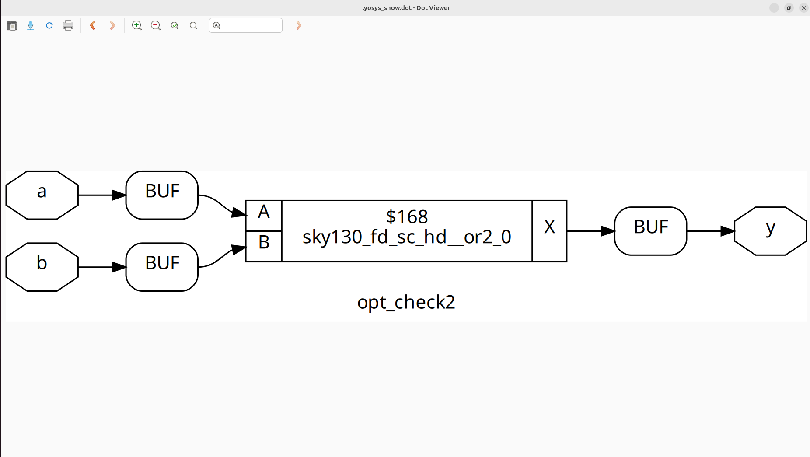
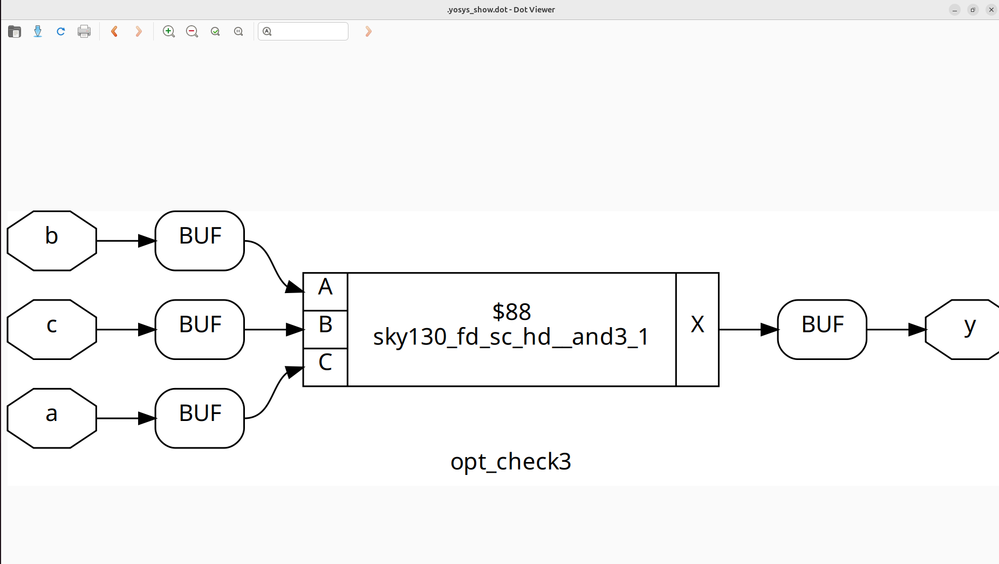
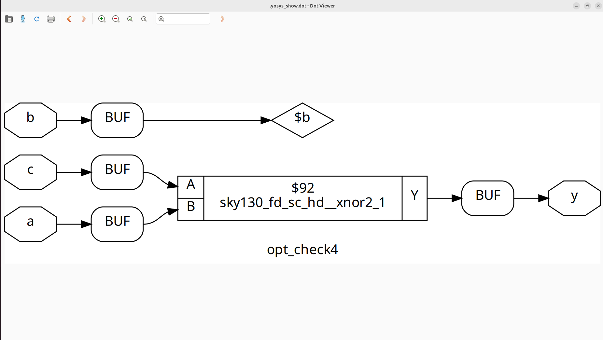
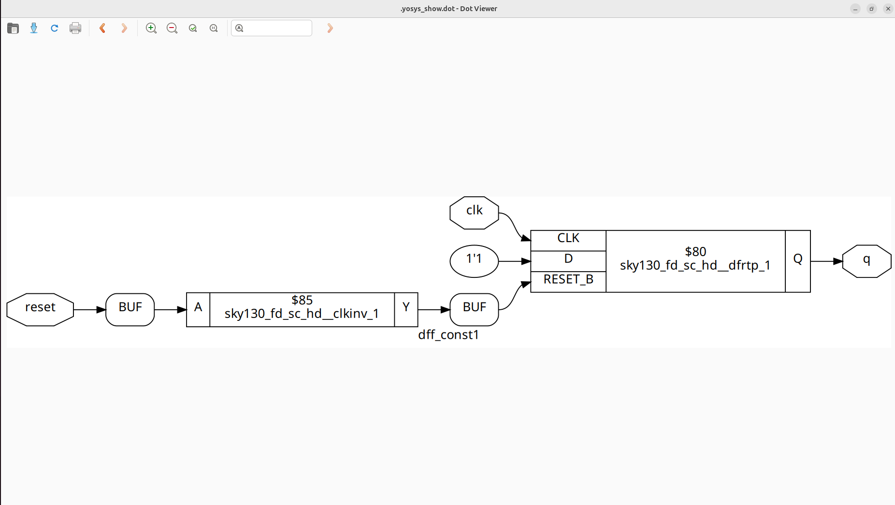

# Day 3: Optimizing Combinational and Sequential Circuits

Welcome to Day 3 of week1! The content of the day focuses on methods to optimize both combinational and sequential circuits, aiming to improve performance, reduce resource usage, and enhance overall design efficiency.

---

## Agenda

- [1. Constant Propagation](#1-constant-propagation)  
- [2. State Minimization](#2-state-minimization)  
- [3. Circuit Cloning](#3-circuit-cloning)  
- [4. Retiming Techniques](#4-retiming-techniques)  
- [5. Optimization Lab Exercises](#5-optimization-lab-exercises)  
  - [Lab 1](#lab-1)  
  - [Lab 2](#lab-2)  
  - [Lab 3](#lab-3)  
  - [Lab 4](#lab-4)  
  - [Lab 5](#lab-5)  
  - [Lab 6](#lab-6)
## 1. Constant Propagation

In VLSI design, constant propagation is an optimization technique where variables with known constant values are replaced directly during synthesis. This helps simplify the logic and can improve overall circuit performance.

**How it works:**  
The synthesis tool scans the design to detect variables that hold fixed values. These constants are substituted into the logic, enabling simplification and reducing unnecessary circuitry.

**Advantages:**
- **Simplified Logic:** Reduces design complexity and circuit size.  
- **Improved Performance:** Shorter paths and faster signal propagation.  
- **Efficient Resource Usage:** Fewer gates or flip-flops are needed.
## 2. State Minimization

State optimization focuses on refining **finite state machines (FSMs)** to make designs more efficient. It reduces unnecessary states, improves state encoding, and minimizes associated logic.

**Process:**
- **State Reduction:** Merge states that are equivalent using algorithms.  
- **State Encoding:** Assign compact or optimized codes to states for efficiency.  
- **Logic Minimization:** Apply Boolean simplification or synthesis tools to generate smaller logic equations.  
- **Power Reduction:** Techniques such as clock gating help lower dynamic power consumption.  

---

## 3. Circuit Cloning

Cloning involves creating duplicates of a logic cell or module to enhance performance, reduce power consumption, or improve timing by balancing signal load or minimizing interconnect length.

**Steps:**
- Analyze the design to locate critical paths.  
- Duplicate the selected cell or module.  
- Redistribute connections to evenly balance the load.  
- Integrate the cloned cell during placement and routing.  
- Verify improvements through timing and power analysis.  


---

## 4. Retiming Techniques

Retiming is an optimization technique that improves **circuit performance** by relocating registers (flip-flops) without altering the circuit’s functionality.

**Procedure:**
1. **Graph Modeling:** Represent the circuit as a directed graph.  
2. **Register Repositioning:** Shift registers to balance the delays along different paths.  
3. **Constraint Verification:** Ensure timing requirements and functional correctness are maintained.  
4. **Optimization:** Adjust register positions to minimize the clock period and reduce power consumption.  

---

# Optimization Lab Exercises
This repository contains a series of Verilog labs demonstrating logic optimization and synthesis techniques.

---

## Lab 1

**Verilog Code:**
```verilog
module opt_check (input a , input b , output y);
	assign y = a?b:0;
endmodule
```
**Explanation:**

- y = a ? b : 0;
- If a = 1, y = b
- If a = 0, y = 0

**Synthesis Tip:**
Add the following between abc -liberty and synth -top during Yosys synthesis:
```verilog
opt_clean -purge
```

   

# Lab 2

This lab demonstrates a simple 2-to-1 multiplexer using Verilog.

---

## Verilog Code

```verilog
module opt_check2 (input a , input b , output y);
	assign y = a?1:b;
endmodule
```
**Explanation:**

- Implements a 2-to-1 multiplexer:
- If a = 1, output y is 1.
- If a = 0, output y takes the value of b.
   

  # Lab 3

This lab demonstrates a 2-to-1 multiplexer implemented in Verilog.

---

## Verilog Code

```verilog
module opt_check2 (input a , input b , output y);
	assign y = a?1:b;
endmodule
```
**Explanation:**
- Functions as a 2-to-1 multiplexer:
- If a = 1, output y is 1.
- If a = 0, output y takes the value of b.
   

  # Lab 4

This lab demonstrates the simplification of nested ternary logic in Verilog.

---

## Verilog Code

```verilog
module opt_check4 (input a , input b , input c , output y);
 assign y = a?(b?(a & c ):c):(!c);
 endmodule
```
**Explanation:**

- Three-input logic module (a, b, c) with output y.

- Nested ternary behavior:

- If a = 1, y = c.

- If a = 0, y = !c.

- Simplified form: y = a ? c : !c
  
 

# Lab 5

This lab demonstrates a D flip-flop that loads a constant value when not in reset.

---

## Verilog Code

```verilog
module dff_const1(input clk, input reset, output reg q);
always @(posedge clk, posedge reset)
begin
	if(reset)
		q <= 1'b0;
	else
		q <= 1'b1;
end
endmodule
```
**Explanation:**

- D flip-flop with asynchronous reset:

- When reset = 1, output q is 0.

- When reset = 0, output q is always 1.

 
 

