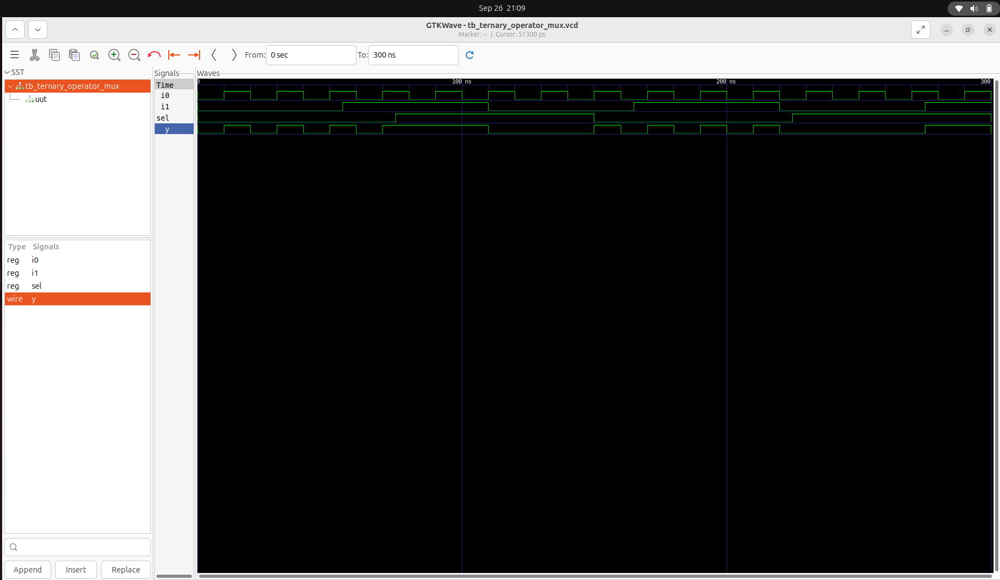
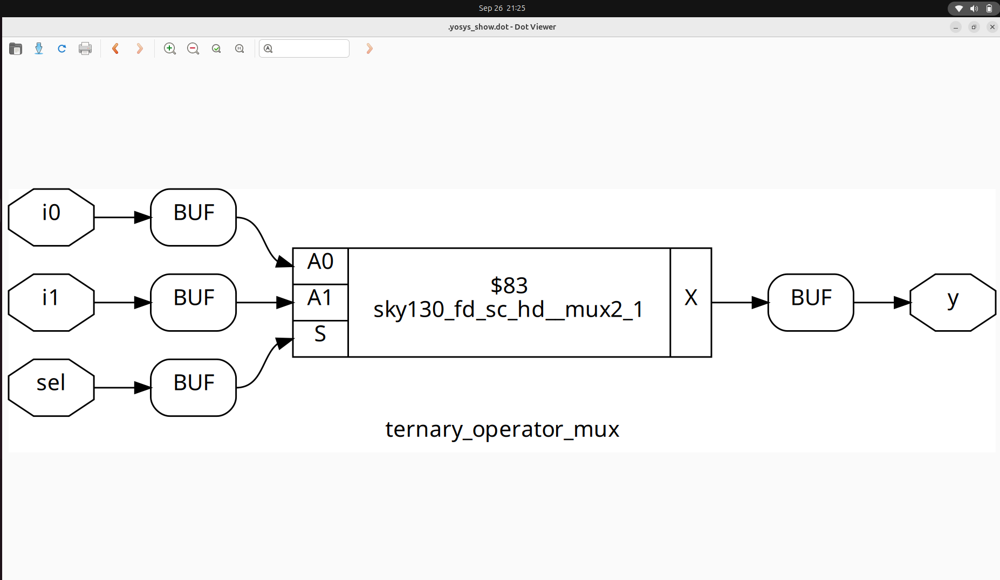
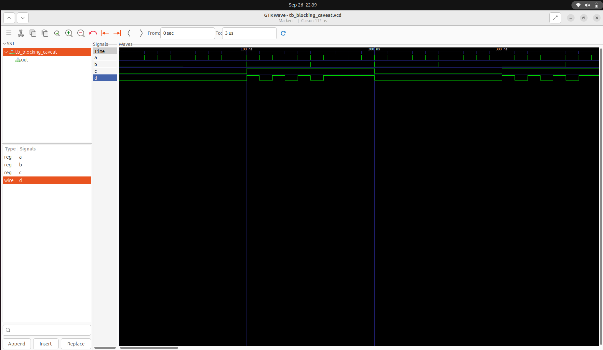

# Day 4: Gate-Level Simulation (GLS), Blocking vs. Non-Blocking in Verilog, and Synthesis-Simulation Mismatch

Welcome to Day 4 of Week1! Today’s content focuses on three essential topics in digital design:

- **Gate-Level Simulation (GLS)**
- **Blocking vs. Non-Blocking Assignments in Verilog**
- **Synthesis-Simulation Mismatch**

## Table of Contents

- [1. Gate-Level Simulation (GLS)](#1-gate-level-simulation-gls)
- [2. Synthesis-Simulation Mismatch](#2-synthesis-simulation-mismatch)
- [3. Blocking vs. Non-Blocking Assignments in Verilog](#3-blocking-vs-non-blocking-assignments-in-verilog)
  - [3.1 Blocking Statements](#31-blocking-statements)
  - [3.2 Non-Blocking Statements](#32-non-blocking-statements)
- [4. Labs](#4-labs)
- [5. Summary](#5-summary)

---

## 1. Gate-Level Simulation (GLS)

**GLS** stands for **Gate-Level Simulation**. It is a critical verification step in the VLSI design flow where the synthesized gate-level netlist of a digital circuit is simulated to validate:

- Functional correctness
- Timing behavior
- Power estimates
- Test structures (e.g., scan chains for DFT)

### Why Perform GLS?

- **Synthesis Validation**: Ensures that synthesis tools faithfully translate RTL into gates.
- **Timing Verification**: Simulates with realistic delays (from SDF files), allowing you to check for timing violations (e.g., setup/hold errors).
- **Testability**: Confirms that scan chains and other test features work post-synthesis.

### When is GLS Performed?

- **After synthesis**: Once the RTL is converted into a gate-level netlist.
- **Before physical design**: To catch issues early, before layout.

### Types of GLS

- **Functional GLS**: Logic-only simulation, often with zero or unit delays.
- **Timing GLS**: Uses annotated timing data to check real-world timing behavior.

---

## 2. Synthesis-Simulation Mismatch

A **synthesis-simulation mismatch** occurs when the simulation results of RTL (pre-synthesis) do not match simulation results of the gate-level netlist (post-synthesis) or hardware. Reasons include:

- **Non-synthesizable constructs**: Use of delays, initial blocks, or other code not supported by synthesis.
- **Incomplete or ambiguous coding**: E.g., missing `else` clauses, improper sensitivity lists.
- **Tool interpretation differences**: Simulation and synthesis tools may interpret ambiguous RTL differently.

**Key Point:** Always write synthesizable, unambiguous RTL and follow good coding practices to minimize mismatches.

---

## 3. Blocking vs. Non-Blocking Assignments in Verilog

Verilog offers two types of procedural assignments:

### 3.1 Blocking Statements

- **Syntax:** `=`
- **Execution:** Sequential, executes immediately.
- **Suitable for:** Combinational logic (e.g., `always @(*)`).
- **Example:**  
  ```verilog
  always @(*) y = a & b;
  ```

### 3.2 Non-Blocking Statements

- **Syntax:** `<=`
- **Execution:** Scheduled, executes concurrently at the end of the time step.
- **Suitable for:** Sequential logic (e.g., `always @(posedge clk)`).
- **Example:**  
  ```verilog
  always @(posedge clk) q <= d;
  ```


## 4. Labs

### Lab 1: Ternary Operator MUX

Verilog code for a simple 2:1 multiplexer using a ternary operator:

```verilog
module ternary_operator_mux (input i0, input i1, input sel, output y);
  assign y = sel ? i1 : i0;
endmodule
```
- **Function:** `y = i1` if `sel = 1`; else `y = i0`.



---

### Lab 2: Synthesis Using Yosys

Synthesize the above MUX using Yosys.  
_Follow the standard Yosys synthesis flow._



---

### Lab 3: Gate-Level Simulation (GLS) of MUX

Run GLS for the synthesized MUX.  
Use this command (adjust paths as needed):

```shell
iverilog /path/to/primitives.v /path/to/sky130_fd_sc_hd.v ternary_operator_mux.v testbench.v
```


---

### Lab 4: Bad MUX Example (Common Pitfalls)

Verilog code with intentional issues:

```verilog
module bad_mux (input i0, input i1, input sel, output reg y);
  always @ (sel) begin
    if (sel)
      y <= i1;
    else 
      y <= i0;
  end
endmodule
```

#### Issues:
- **Incomplete sensitivity list**: Should include `i0`, `i1`, and `sel`.
- **Non-blocking assignment in combinational logic**: Should use blocking assignments (`=`).

**Corrected version:**
```verilog
always @ (*) begin
  if (sel)
    y = i1;
  else
    y = i0;
end
```


---


### Lab 5: Blocking Assignment Caveat

Verilog code:

```verilog
module blocking_caveat (input a, input b, input c, output reg d);
  reg x;
  always @ (*) begin
    d = x & c;
    x = a | b;
  end
endmodule
```

#### What’s wrong?
- The order of assignments causes `d` to use the old value of `x`—not the newly computed value.
- **Best Practice:** Assign intermediate variables before using them.

**Corrected order:**
```verilog
always @ (*) begin
  x = a | b;
  d = x & c;
end
```



---


## 5. Summary

- **Gate-Level Simulation (GLS):** Validates netlist functionality, timing, and testability after synthesis.
- **Synthesis-Simulation Mismatch:** Avoid by using synthesizable, unambiguous RTL code.
- **Blocking vs. Non-Blocking:** Use blocking (`=`) for combinational, non-blocking (`<=`) for sequential logic.
- **Labs:** Reinforce key concepts and highlight common RTL pitfalls.

---
