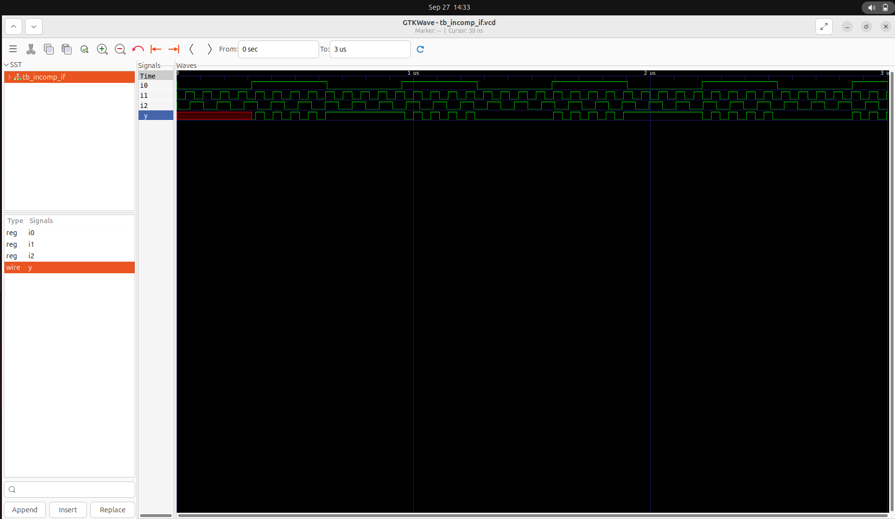
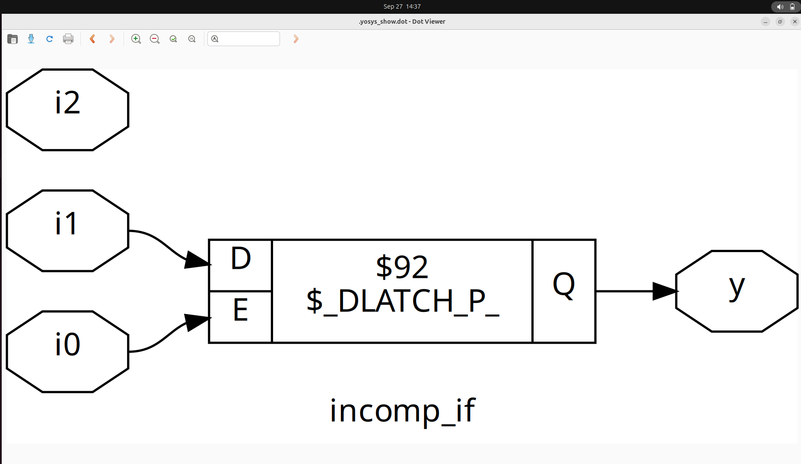
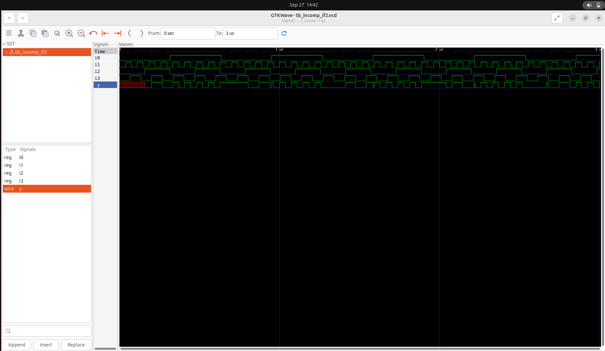
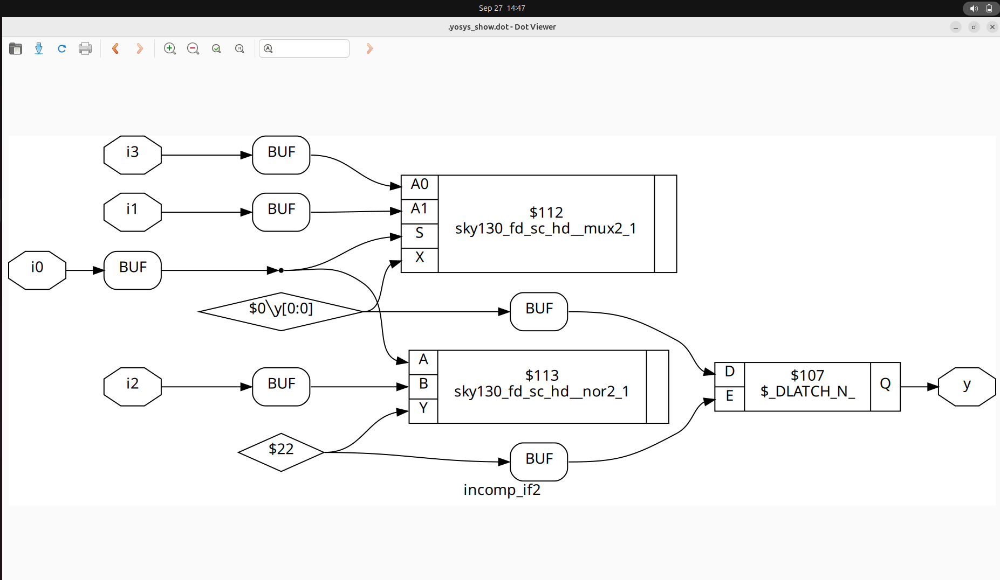
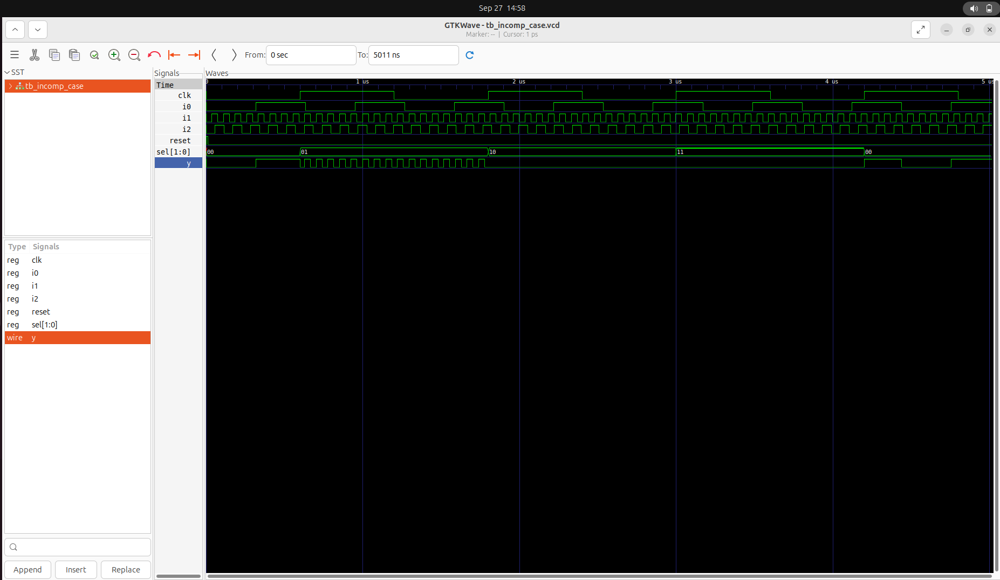

# Day 5: Optimization in Synthesis

Welcome to Day 5 of week1! Today's content focuses on `if-else` statements, `for` loops, generate blocks, and explore how improper coding can lead to inferred latches. 

---
## Contents

- [1. If-Else Statements in Verilog](#1-if-else-statements-in-verilog)
- [2. Inferred Latches in Verilog](#2-inferred-latches-in-verilog)
- [3. Labs for If-Else and Case Statements](#3-labs-for-if-else-and-case-statements)
  - [Lab 1: Incomplete If Statement](#lab-1-incomplete-if-statement)
  - [Lab 2: Synthesis Result of Lab 1](#lab-2-synthesis-result-of-lab-1)
  - [Lab 3: Nested If-Else](#lab-3-nested-if-else)
  - [Lab 4: Synthesis Result of Lab 3](#lab-4-synthesis-result-of-lab-3)
  - [Lab 5: incomplete Case Statement](#lab-5-incomplete-case-statement)
  - [Lab 6: Synthesis Result of Lab 5](#lab-6-synthesis-result-of-lab-5)
- [Summary](#summary)

---

## 1. If-Else Statements in Verilog

**If-else statements** are used for conditional execution in behavioral modeling, typically within procedural blocks (`always`, `initial`, tasks, or functions).

### Syntax

```verilog
if (condition) begin
    // Code block executed if condition is true
end else begin
    // Code block executed if condition is false
end
```

- **condition**: An expression evaluating to true (non-zero) or false (zero).
- **begin ... end**: Used to group multiple statements. Omit if only one statement is present.
- The `else` part is optional.

#### Nested If-Else

```verilog
if (condition1) begin
    // Code for condition1 true
end else if (condition2) begin
    // Code for condition2 true
end else begin
    // Code if no conditions are true
end
```

---

## 2. Inferred Latches in Verilog

**Inferred latches** occur when a combinational logic block does not assign a value to a variable in all possible execution paths. This causes the synthesis tool to infer a latch, which may not be the designer’s intention.

### Example of Latch Inference

```verilog
module ex (
    input wire a, b, sel,
    output reg y
);
    always @(a, b, sel) begin
        if (sel == 1'b1)
            y = a; // No 'else' - y is not assigned when sel == 0
    end
endmodule
```

**Problem**: When `sel` is 0, `y` is not assigned, so a latch is inferred.

#### Solution: Add Else or Default Case

```verilog
module ex (
    input wire a, b, sel,
    output reg y
);
    always @(a, b, sel) begin
        case(sel)
            1'b1 : y = a;
            default : y = 1'b0; // Default assignment
        endcase
    end
endmodule
```

---

## 3. Labs for If-Else and Case Statements

### Lab 1: Incomplete If Statement

```verilog
module incomp_if (input i0, input i1, input i2, output reg y);
always @(*) begin
    if (i0)
        y <= i1;
end
endmodule
```


---

### Lab 2: Synthesis Result of Lab 1



---

### Lab 3: Nested If-Else

```verilog
module incomp_if2 (input i0, input i1, input i2, input i3, output reg y);
always @(*) begin
    if (i0)
        y <= i1;
    else if (i2)
        y <= i3;
end
endmodule
```


---

### Lab 4: Synthesis Result of Lab 3



---

### Lab 5: incomplete Case Statement

```verilog
module partial_case_assign (input i0, input i1, input i2, input [1:0] sel, output reg y,output reg x);
always @(*) begin
    case(sel)
        2'b00 : begin
                y = i0;
                x = i2;
                end
       2'b01 :  y = i1;
        default : begin
                x = i1;
                y = i2;
    endcase
end
endmodule
```


---

### Lab 6: Synthesis Result of Lab 5


---


# Verilog Basics: For Loops, Generate Blocks, and Ripple Carry Adder

This document provides an overview of **For Loops**, **Generate Blocks**, and the **Ripple Carry Adder (RCA)** in Verilog with clear explanations and key points.

---

## 1. For Loops in Verilog

A **for loop** in Verilog is used within procedural blocks (`initial`, `always`, or tasks/functions) to execute a set of statements repeatedly based on a loop counter.

### Key Points:
- Must be used **inside procedural blocks**.  
- **Synthesizable** only if the number of iterations is fixed at compile time.  
- Useful for repetitive tasks such as initialization and iterative operations.  

---

## 2. Generate Blocks in Verilog

A **generate block** allows the creation of hardware structures programmatically at **compile time**, enabling scalable designs with multiple instances of modules or logic elements.

### Key Points:
- Requires `generate` and `endgenerate` keywords.  
- Often used with `for` loops and `genvar`.  
- Creates **repeated hardware structures** efficiently and is essential for parameterized designs.  

---

## 3. Ripple Carry Adder (RCA)

A **Ripple Carry Adder (RCA)** is a digital circuit used to add two binary numbers by chaining multiple **full adders**.

### Key Points:
- **n-bit RCA** requires *n* full adders connected in series.  
- Carry-out from each full adder is passed to the next stage, causing the carry signal to **ripple** through the chain.  
- **Simple design** but **slower for large bit-widths** due to carry propagation delay.  

---

## 4. Applications

- **For Loops:** Testbench stimulus, initialization, iterative calculations.  
- **Generate Blocks:** Scalable module instantiation like adders, registers, multipliers.  
- **RCA:** Basic arithmetic units in ALUs, simple digital systems.  


## Summary

- Use complete if-else and case statements to avoid unintended latch inference.
- For loops and generate blocks are powerful for writing scalable, synthesizable code.
- Always ensure every signal is assigned in every possible execution path for combinational logic.
- Use labs to reinforce concepts with practical Verilog code and synthesis results.

---
